# Places Around Me
## AIM:
To develop a website to display details about the places around my house.

## Design Steps:

### Step 1:
create new django project,create django app in that project and then in setting.py change Allowedhost and list your app name in Installedapps list    
### Step 2:
Then create templates folder in your app,in templates folder create app folder then in that create html files  
### Step 3:
After writing html code in html files,define them in views.py and mention their path in urls.py 
### Step 4:
After completing these steps save all files and run server

## HTML Code:
### For displaying Map:
```
<!DOCTYPE html>
<html lang='en'>
    <head>
        <title>Places Around My Home</title>
    </head>
    <body>
        <h1>Places near by my home</h1>
        
        <MAP name="MapNew">
            <area shape="poly" alt="Myhome" coords="997,244,1039,187,1137,241,1145,220,1202,252,1154,338,1031,576,888,445" href= "/home/Myhome" Title="Myhome">
            <area shape="poly" alt="Milkfarm" coords="1385,543,1348,632,1419,674,1462,577,1300,517,1269,597,1345,630" href="/home/Milkfarm" Title="Milkfarm">
            <area shape="poly" alt="Tutioncentre" coords="624,134,584,216,685,285,734,191" href="/home/Tutioncentre" Title="Tutioncentre">
            <area shape="poly" alt="Rationshop" coords="824,493,730,621,822,673,900,553"  href="/home/Rationshop" Title="Rationshop">
            <area shape="poly" alt="Generalstores" coords="395,175,355,250,428,294,472,220"  href="/home/Generalstores" Title="Generalstores">
        </MAP>


    </body>
</html>
```
### For displaying Myhome Page:
```
<!DOCTYPE html>
<html lang='en'>
    <head>
        <title>Myhome</title>
    </head>
    <body>
        <h1>Welcome</h1>
        <h1>Neelas towers is my apartment name in which I stay in 5th floor,flatno:405</h1>
        <h1>its address is near vedayapalem centre ,Nellore, Andhra Pradesh</h1>
        <h1>in this apartment there are 30 flats</h1>
        <h1>each floor has 6 flats</h1>
        <h1>in that 6 flats 2 flats are 3BHK and remaining 4 flats are 2BHK</h1>
        
    </body>
</html>
```
### For displaying Milfarm Page:
```
<!DOCTYPE html>
<html lang='en'>
    <head>
        <title>Milkfarm</title>
    </head>
    <body>
        <h1>Welcome</h1>
        <h1>This is milkfarm which is near to myhome</h1>
        <h1>in this milkfarm nearly 10 buffaloes are there</h1>
        <h1>there are nearly 10 workers in this farm who take care of buffalo</h1>
        <h1>here in this farm 1 litre milk is nearly 60 rupees</h1>
        <h1>milk in this farm is rich in quality and also has good taste</h1>
    </body>
</html>
```
### For displaying Rationshop:
```
<!DOCTYPE html>
<html lang='en'>
    <head>
        <title>Rationshop</title>
    </head>
    <body>
        <h1>Welcome</h1>
        <h1>This Rationshop is near to my home</h1>
        <h1>this rationshop distributes rice, oil, and some groceries to poor people who are having rationcard</h1>
        <h1>this rationcards are given to the people who are below poverty line by government</h1>
        <h1>beacase of these rationshops poor people are leading their life in a easy way</h1>
    </body>
</html>
```
### For displaying Tutioncentre:
```
<!DOCTYPE html>
<html lang='en'>
    <head>
        <title>Tutioncentre</title>
    </head>
    <body>
        <h1>Welcome</h1>
        <h1>This is my tutioncentre which is near to my home</h1>
        <h1>The name of the tution centre is Raman Institute</h1>
        <h1>There are nearly 50 students in this tution centre</h1>
        <h1>and there are nearly 5 teachers in this tution centre</h1>
        <h1>in this institute they teach students regarding studies and technical skills for better future</h1>
    </body>
</html>
```
### For displaying Generalstores:
```
<!DOCTYPE html>
<htmL lang='en'>
    <head>
        <title>Generalstores</title>
    </head>
    <body>
        <h1>Welcome</h1>
        <h1>This General Store is near to my home</h1>
        <h1>The name of the General store is Gopi General Stores</h1>
        <h1>In that general store every item is available at decent price</h1>
        <h1>It provides free home delivery of groceries to home of the customer</h1>
        <h1>And at the time of festivals the discount on each and every item is high</h1>
    </body>
</htmL>
```

## Output:
### Map Output:
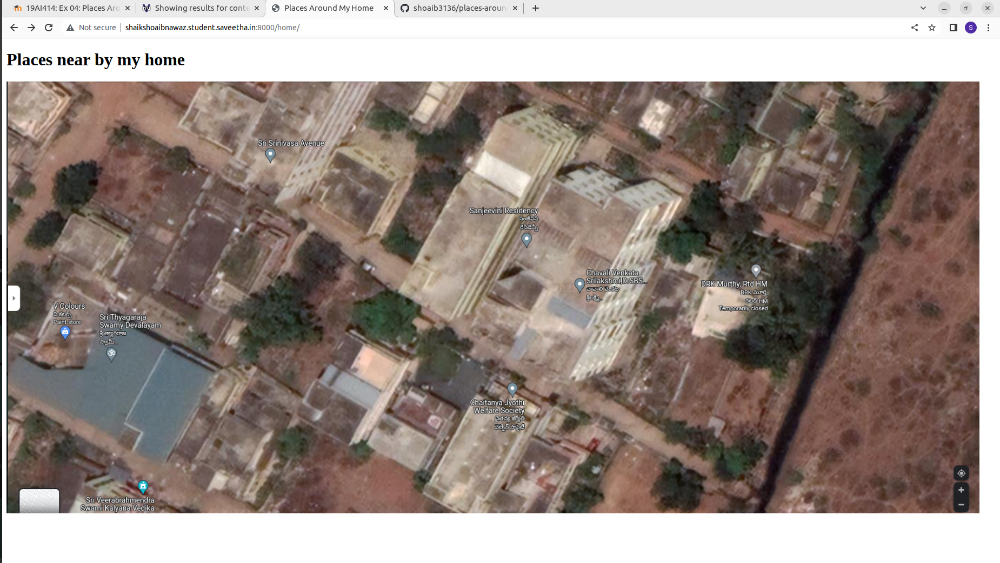
### Myhome Output:
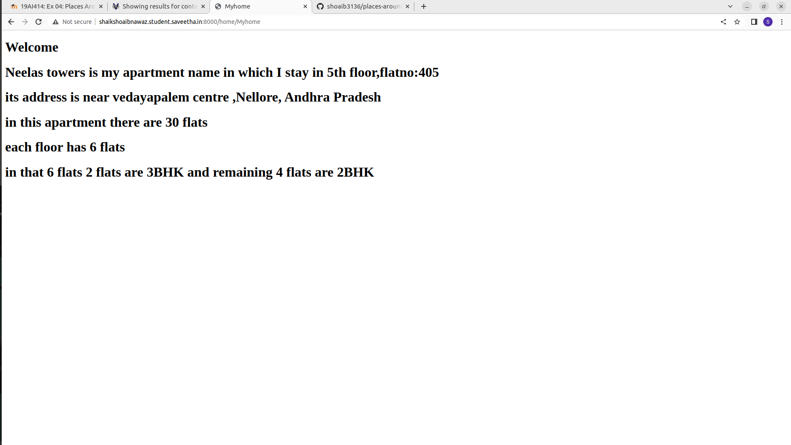
### Milkfarm Output:

### Rationshop Output:
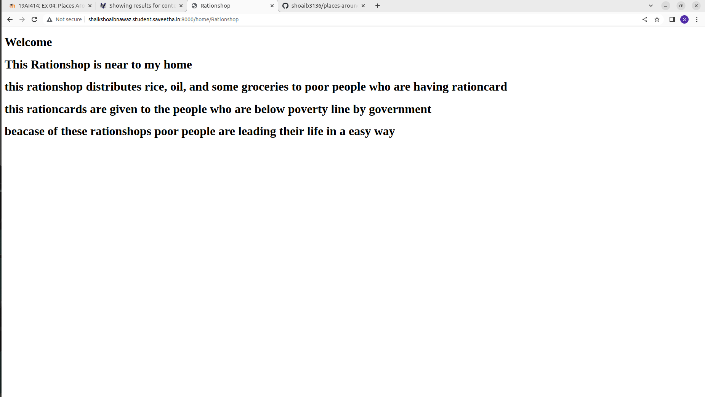
### Tutionshop Output:
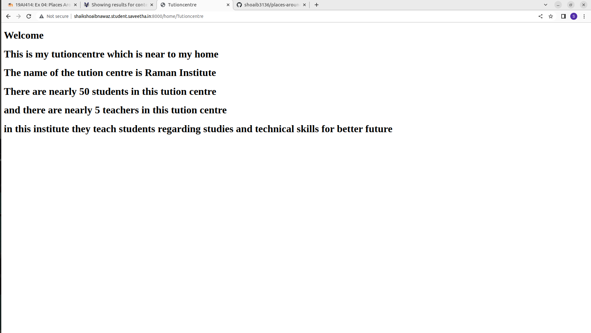
### Generalstores Output:
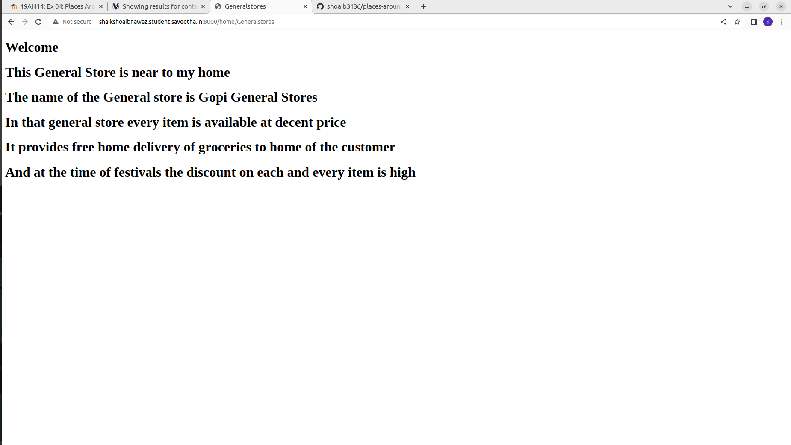
### HTMl validation of Map:
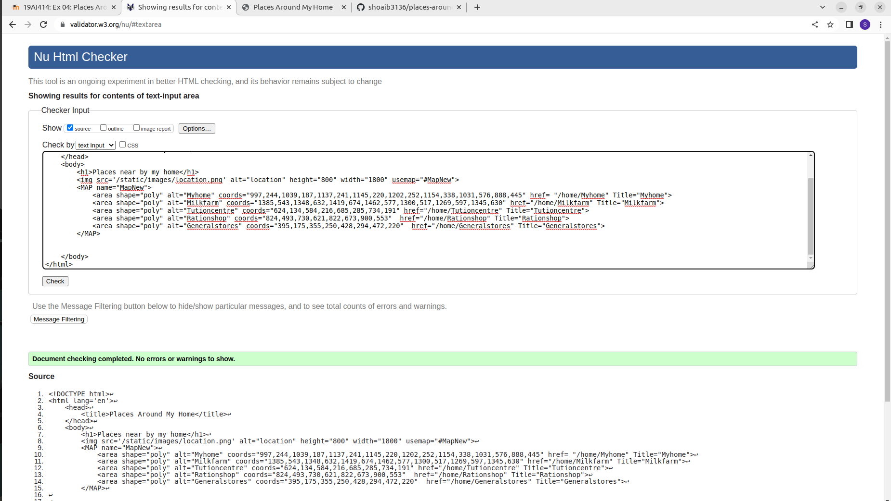
### HTML validation of Myhome:
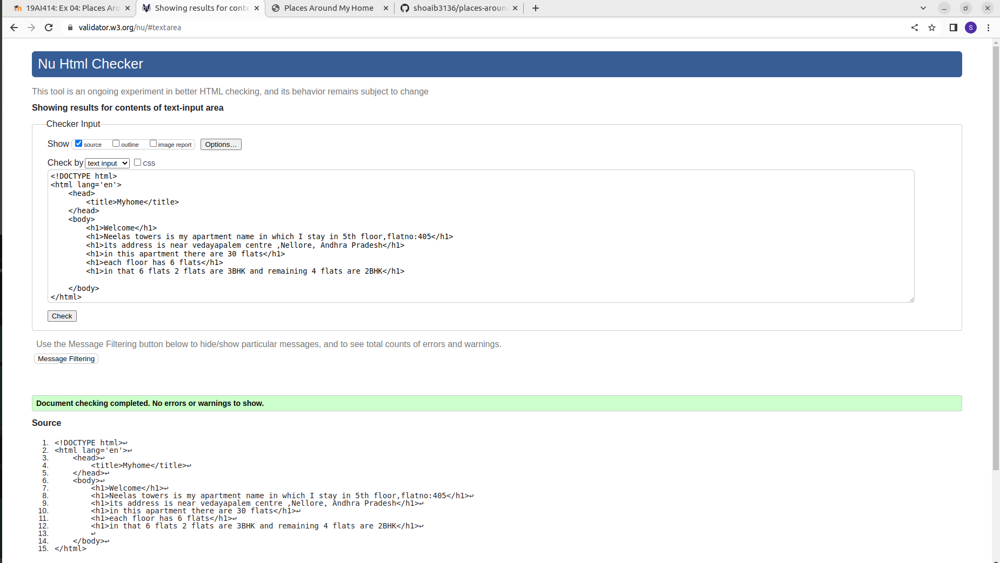
### HTML validation of Milkfarm:
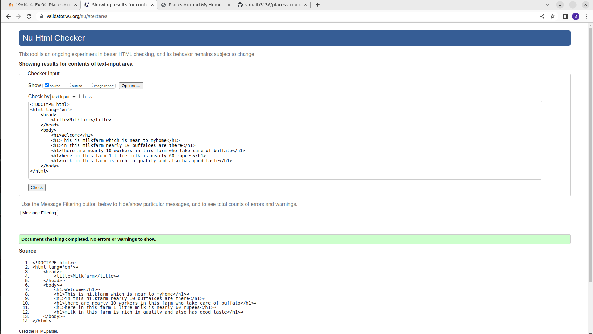
### HTML validation of Rationshop:
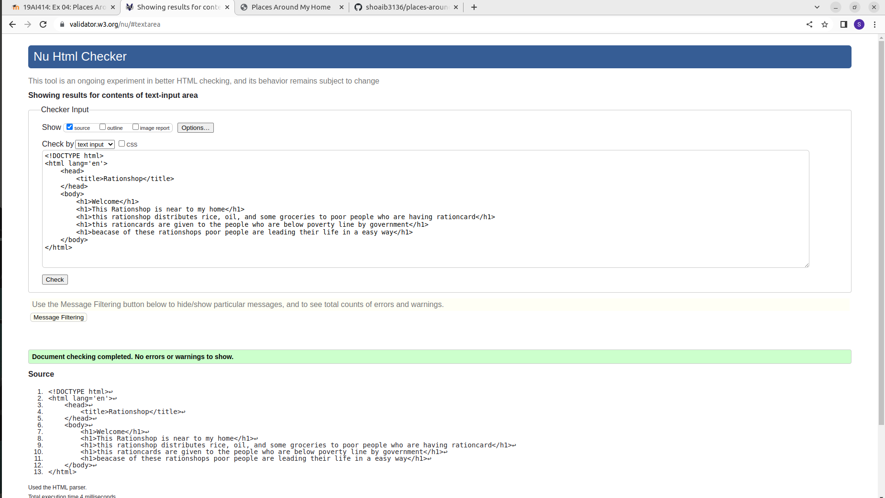
### HTML validation of Tutioncentre:
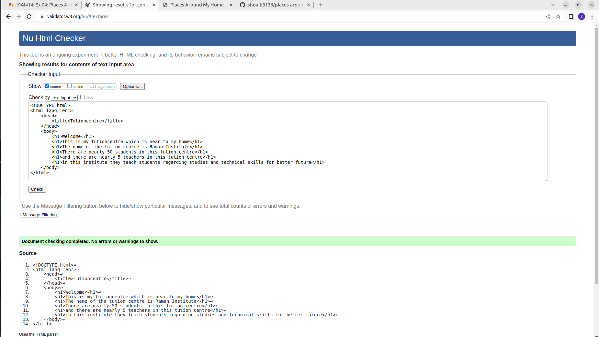
### HTML validation of Generalstores:
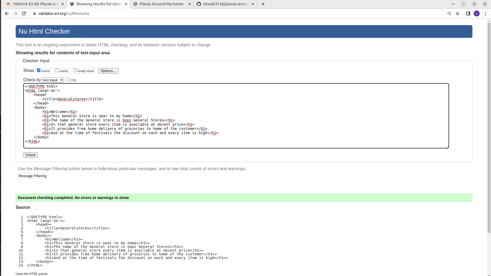
## Result:
Thus the website is successfully displaying the places around me